# Gestion des utilisateurs, droits et processus 

**Lien des consignes :** [TP-3](https://sand-metacarpal-859.notion.site/TP-3-Gestion-des-utilisateurs-droits-et-processus-28fa4f0ae4ab800690d9e6a39e01d44f)

## 🎯 Objectifs du TP

- Créer, modifier et supprimer des utilisateurs et des groupes.
- Comprendre et manipuler les droits d’accès (lecture, écriture, exécution).
- Identifier et gérer les processus actifs du système.
- Diagnostiquer un problème de permission ou de service bloqué.

## 🪜 Étapes de réalisation

1. **Préparation du terrain**
    - Identifie les utilisateurs existants sur le système.
    - Crée deux nouveaux comptes : un utilisateur standard et un administrateur.
2. **Gestion des droits d’accès**
    - Crée un répertoire partagé entre deux utilisateurs.
    - Restreins l’accès pour les autres comptes.
    - Corrige un problème de droit d’accès sur un fichier (tu peux simuler une erreur toi-même).
3. **Observation des processus**
    - Liste les processus actifs.
    - Identifie les 5 qui consomment le plus de CPU ou de mémoire.
    - Termine un processus spécifique sans éteindre la machine.
4. **Simulation d’incident**
    - Stoppe un service système (ex : `apache2` ou `cron`) puis relance-le.
    - Vérifie son état et note les commandes utilisées.
5. **Nettoyage et documentation**
    - Supprime ou désactive les utilisateurs créés pour le test.
    - Note toutes les commandes clés et leur rôle dans ton rapport.

### 🪜 
Étapes de réalisation
1. **Préparation du terrain**
```bash
ls /home
sudo useradd -m testuser
sudo passwd testuser
sudo useradd -m adminuser
sudo passwd adminuser
```
capture d'écran : <br>
**Création des utilisateurs** 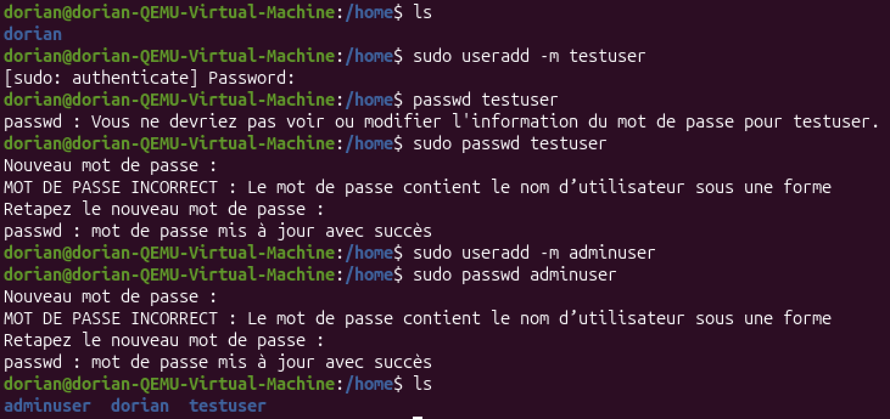
<br><br>

2. **Gestion des droits d’accès**

```bash
sudo mkdir /home/sharedtest
sudo chown testuser:adminuser /home/sharedtest
sudo chmod 770 /home/sharedtest
touch /home/sharedtest critical.txt
sudo chmod 007 /home/sharedtest/critical.txt
sudo chmod 770 /home/sharedtest/critical.txt
```
capture d'écran : <br>
**Dossier partagé et permissions corrigées** 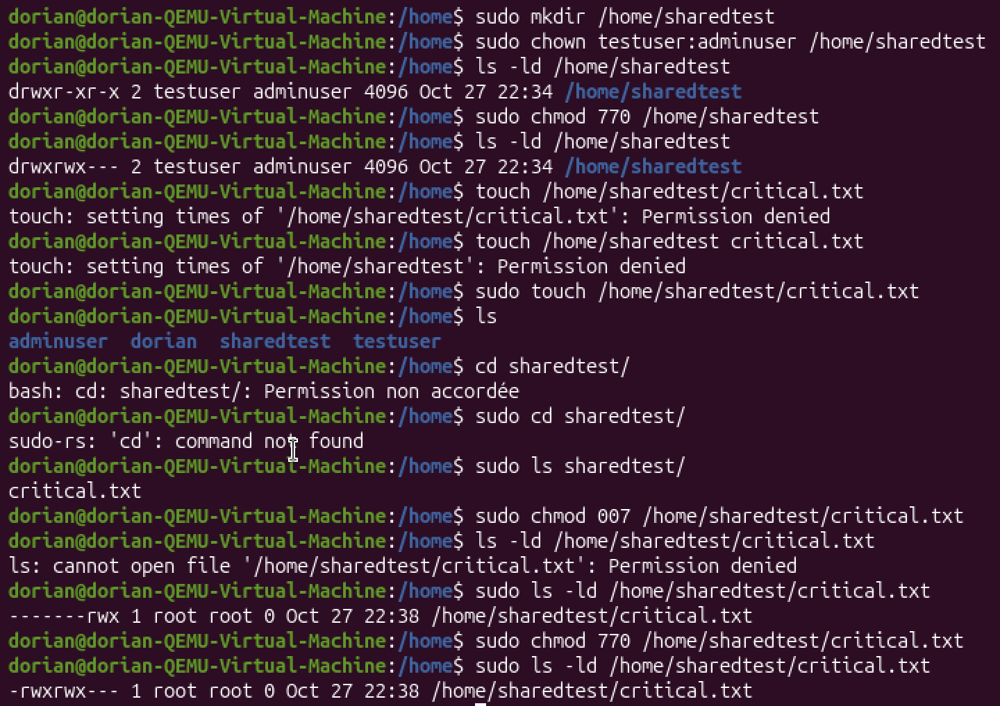
<br><br>

ajout de dorian (mon user), pour tester le dossier partagé (et faire moins de sudo) :
```bash
sudo usermod -aG adminuser dorian
```

3. **Observation des processus**
```bash
ps aux --sort=-%cpu | head -n 6
sudo kill 529 # USB storage process
ps aux | grep 529
```
capture d'écran : <br>
**Liste des processus et terminaison d’un processus** 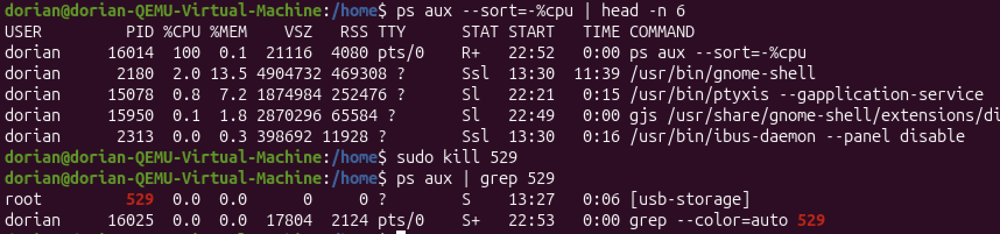
<br><br>

4. **Simulation d’incident**
```bash
sudo systemctl stop cron
sudo systemctl status cron
sudo systemctl start cron
sudo systemctl status cron
```

capture d'écran : <br>
**Arrêt et redémarrage du service cron** 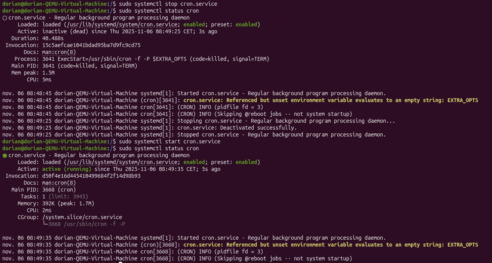
<br><br>

5. **Nettoyage et documentation**
```bash
ls /home
sudo deluser --remove-home testuser
sudo deluser --remove-home adminuser
sudo rm -r /home/sharedtest
ls /home
```
capture d'écran : <br>
**Suppression des utilisateurs et du dossier partagé** 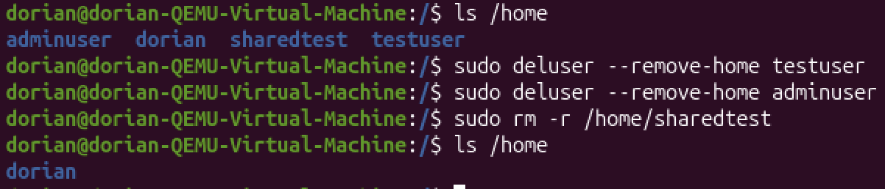
<br><br>

### 📋 Tableau de restitution

| Mission | Commande(s) utilisée(s) | Observation / résultat | Rôle ou explication |
| --- | --- | --- | --- |
| Créer un utilisateur standard | `adduser` | Utilisateur “testuser” créé | Ajout d’un compte local |
| Lister les processus actifs | `ps aux` | Liste complète des processus | Observation du système |
| Corriger un droit d’accès | `chmod 640 fichier.txt` | Lecture autorisée au groupe | Sécurisation du fichier

## Niveau 1 - gestion des utilisateurs

1. Crée un nouvel utilisateur avec un répertoire personnel.
2. Ajoute cet utilisateur à un groupe existant.
3. Change le mot de passe d’un utilisateur.
4. Supprime un utilisateur proprement.

### 📋 Tableau à compléter :
Mission | Commande(s) utilisée(s) | Observation / résultat | Rôle ou explication
--- | --- | --- | ---
**1** | `sudo useradd -m gwen` | Utilisateur "gwen" créé avec répertoire personnel | Crée un nouvel utilisateur avec un répertoire personnel
**1 bis** | `sudo groupadd MDS` | Groupe "MDS" créé | Crée un nouveau groupe
**2** | `sudo usermod -aG MDS gwen` | "gwen" ajouté au groupe "MDS" | Ajoute l'utilisateur "gwen" au groupe "MDS"
**3** | `sudo passwd gwen` | Mot de passe défini pour "gwen" | Définit le mot de passe pour l'utilisateur
**pré 4** | `sudo useradd -m nico`<br> `sudo passwd nico` <br> `sudo usermod -aG MDS nico` | Utilisateur "nico" créé et ajouté au groupe "MDS" | Préparation de l'utilisateur à supprimer
**4** | `sudo deluser --remove-home nico` |  Utilisateur "nico" supprimé avec son répertoire | Supprime l'utilisateur et son répertoire personnel

### Contenu du fichier /etc/group après les modifications :
```bash
sudo cat /etc/group #pour voir les groupes et leurs membres
```
```bash 
dorian:x:1000:
gwen:x:1001:
MDS:x:1002:gwen,dorian
```
## Niveau 2 - gestion des droits
1. Crée un dossier partagé entre deux utilisateurs.
2. Restreins son accès aux autres utilisateurs.
3. Corrige un problème de permission sur un fichier critique.
4. Identifie les fichiers appartenant à `root` dans `/etc`.


### 📋 Tableau à compléter :
Mission | Commande(s) utilisée(s) | Observation / résultat | Rôle ou explication
--- | --- | --- | ---
**1** | `sudo mkdir /home/shared`<br>`sudo chown dorian:MDS /home/shared`| Dossier "shared" créé et accessible par "dorian" et groupe "MDS" | Crée un dossier partagé
**2** | `sudo chmod 770 /home/shared` | Accès restreint aux membres du groupe | Restreint l'accès aux autres utilisateurs
**3** | `touch /home/shared/critical.txt`<br>`sudo chmod 640 /home/shared/critical.txt` <br> `sudo chmod 770 /home/shared/critical.txt` | Permissions corrigées sur "critical.txt" | Corrige les permissions du fichier
**4** | `sudo find /etc -user root` | Liste des fichiers appartenant à root dans /etc | Identifie les fichiers root

capture d'écran : <br>
**2** 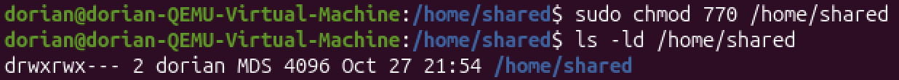

**3** 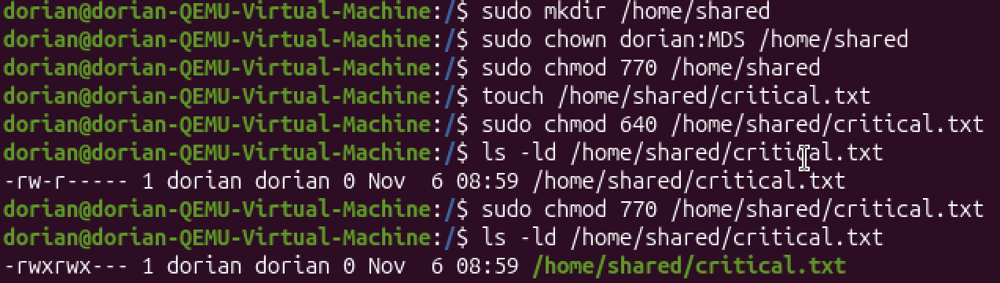

**4** 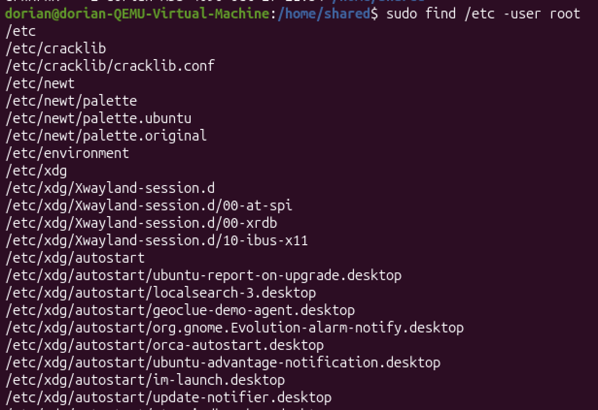... (c'est très long !)

## Niveau 3 — Processus et services

1. Liste les processus actifs et identifie ceux liés à ton utilisateur.
2. Termine un processus spécifique.
3. Observe les services démarrés au boot.
4. Redémarre un service arrêté et vérifie son statut.

### 📋 Tableau à compléter :
Mission | Commande(s) utilisée(s) | Observation / résultat | Rôle ou explication
--- | --- | --- | ---
**1** | `ps aux | grep dorian` | Liste des processus liés à "dorian" (moi) | Observe les processus de l'utilisateur
**2** | `sudo kill 2025` | Processus terminé | Termine un processus spécifique (ici pipewire-pulse)
**3** | `systemctl list-unit-files --type=service --state=enabled` | Liste des services démarrés au boot | Observe les services activés au démarrage
**4** | `sudo systemctl stop cron.service`<br> `sudo systemctl status cron`<br> `sudo systemctl start cron.service`<br> `sudo systemctl status cron` | Service "cron" redémarré et statut vérifié | Redémarre un service et vérifie son état

capture d'écran : <br>
**1** 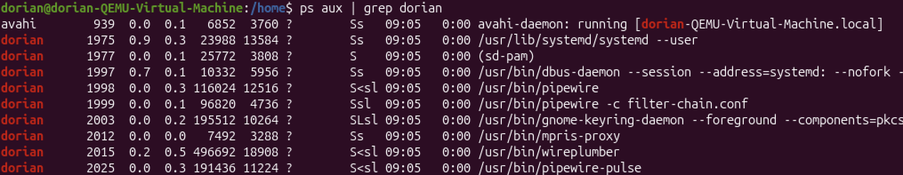 <br>
(c'est encore très long !)<br>
**2** 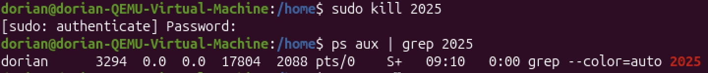
**3** 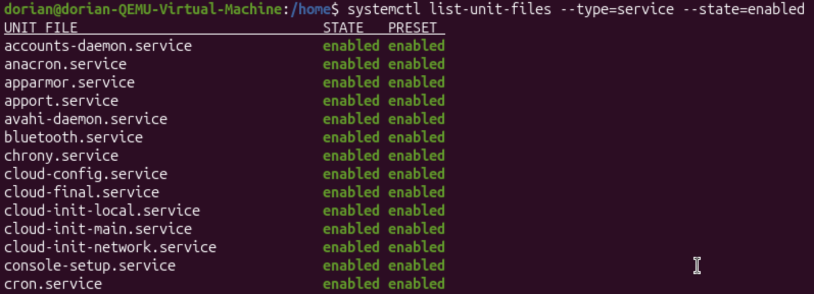 <br>
(pareil ici !)<br>
**4** 