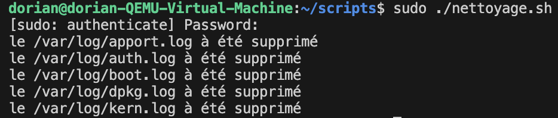
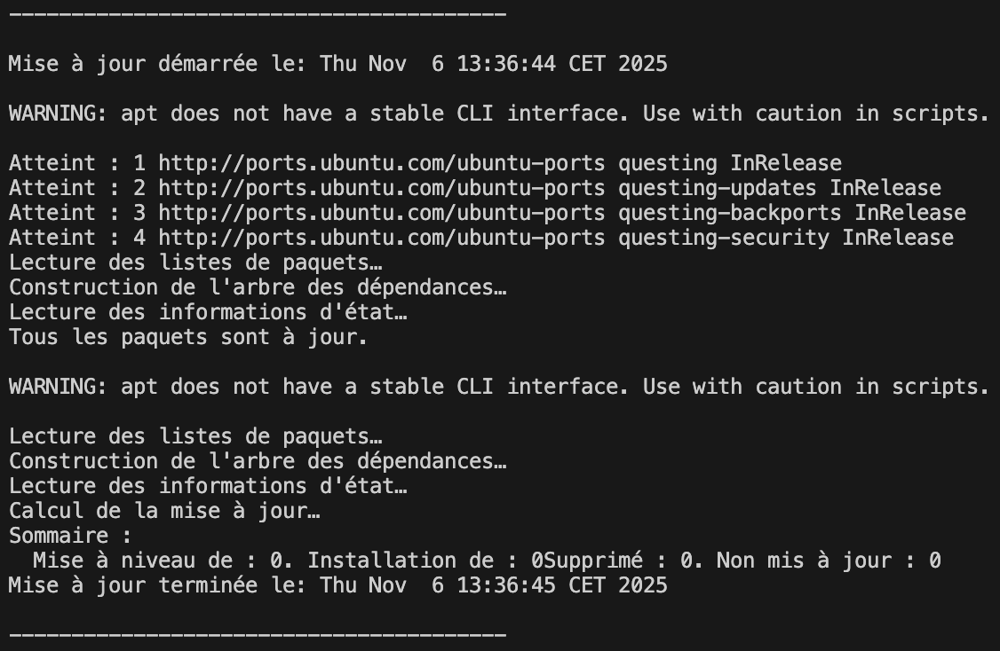

# TP 4 – Crée un script utile pour ton système

**Lien des consignes :** [TP-4](https://sand-metacarpal-859.notion.site/TP-4-Cr-e-un-script-utile-pour-ton-syst-me-28fa4f0ae4ab80739dfdc427e43bda0d)

## 🎯 Objectif

Écrire un **script Bash exécutable** capable d’automatiser une tâche simple du système.

Le but n’est pas de recopier un exemple, mais de **comprendre comment une suite de commandes devient un outil.**

## Mission 

Mission	| Résultat attendu
--- | ---
🧹 Nettoyage automatique | Supprimer les fichiers .log ou .tmp de plus de 7 jours dans un dossier.
💾 Sauvegarde rapide | Créer une archive compressée (.tar.gz) d’un dossier choisi.
🩺 Rapport système | Générer un fichier texte qui affiche la date, la RAM libre, la charge CPU et l’espace disque.
📦 Mise à jour automatisée | Mettre à jour les paquets (apt update && apt upgrade) et enregistrer le résultat dans un fichier.

## Étapes de réalisation

pour ça je dois :

1. Créer un fichier script (`.sh`).
2. Le rendre exécutable.
3. Tester et corriger les erreurs.
4. Le faire s’exécuter automatiquement (indice : planification).

Tu peux utiliser la documentation, les manuels (`man`), les forums ou ton IA, mais **tu dois comprendre chaque ligne que tu ajoutes**.

## Réalisation des missions

### Mission:  🧹 Nettoyage automatique

voir mon script en cliquant ici : [script.sh](scripts/nettoyage.sh)

voici le résultat :
```bash
nano nettoyage.sh
sudo chmod +x scripts/nettoyage.sh
sudo ./nettoyage.sh
```
 <br>

### Mission: 📦 Mise à jour automatisée

voir mon script en cliquant ici : [script.sh](scripts/maj.sh)

voici le résultat :

```bash
nano maj.sh
sudo chmod +x scripts/maj.sh
sudo ./maj.sh
cat /var/log/maj/maj.log
```
