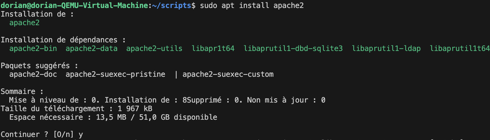
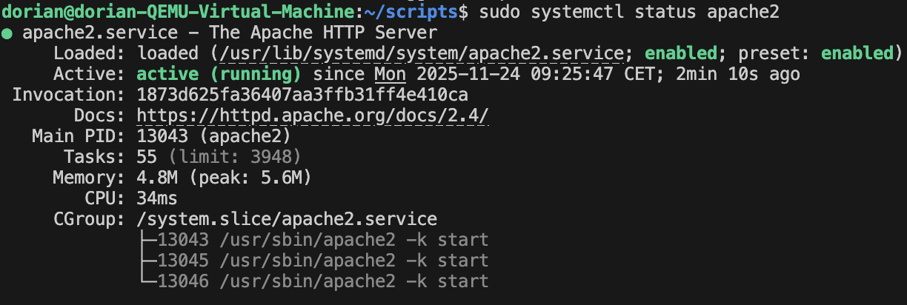
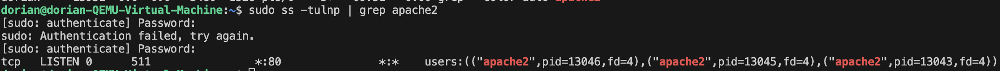
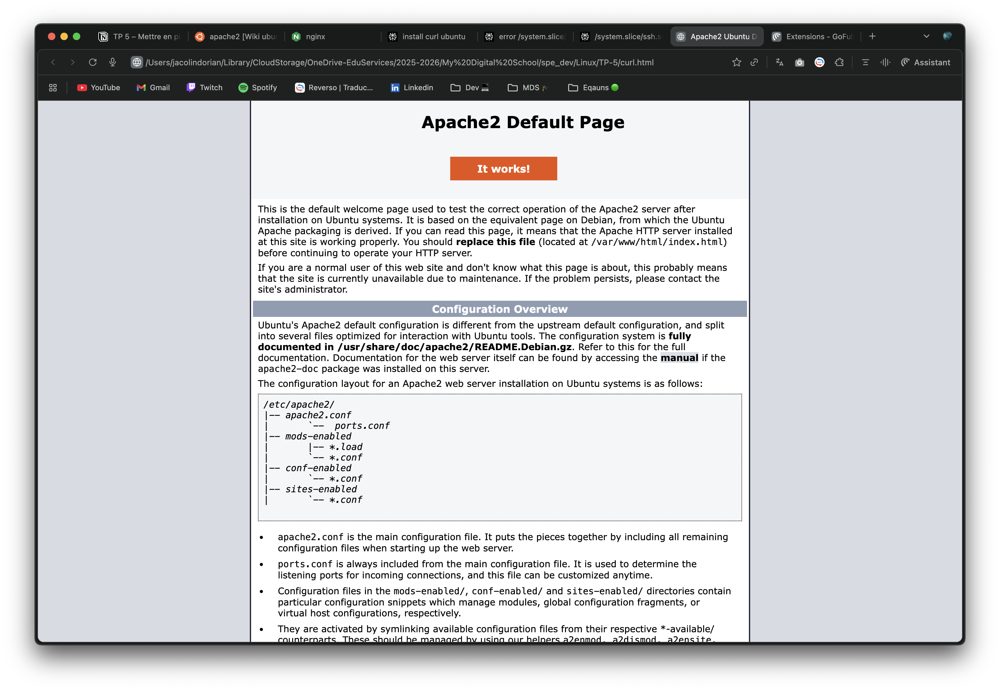

# 🌐 TP 5 – Mettre en place et diagnostiquer un service réseau

**Lien des consignes :** [TP-5](https://sand-metacarpal-859.notion.site/TP-5-Mettre-en-place-et-diagnostiquer-un-service-r-seau-28fa4f0ae4ab803aa09fc15b44a60f20)

## 🎯 Objectif

Découvrir comment un **service** fonctionne sous Linux et comment le rendre **disponible et opérationnel**.

À la fin du TP, ton système doit héberger un service accessible localement.

## Mission

| Mission | Résultat attendu |
| --- | --- |
| 🌍 **Serveur Web local** | Ton poste héberge une page web accessible sur `http://localhost`. |
| 🔑 **Serveur SSH** | Ton poste accepte une connexion SSH depuis une autre machine. |
| 📁 **Serveur de fichiers** | Un dossier partagé est accessible par un autre utilisateur local. |
| 🔄 **Surveillance d’un service** | Un script vérifie régulièrement qu’un service est “actif” et enregistre son état dans un log. |

## Étapes de réalisation

1. Installer et configurer le service choisi.
2. Le démarrer, l’arrêter et vérifier son état.
3. Identifier sur quel **port** il écoute.
4. Tester son accessibilité depuis le terminal (ou un navigateur pour le web).
5. Le rendre **persistant au démarrage** du système.


## Réalisation des missions

### Mission: 🌍 Serveur Web local

D'abord utilisé le script 
[maj.sh](../TP-4/scripts/maj.sh)
crée lors de TP 4 afin de mettre a jour le système
```bash
cd ~/scripts
sudo ./maj.sh
```
Ensuite, installer le serveur web Apache2
```bash
sudo apt install apache2
```

*taper `Y` pour confirmer l'installation.*

Vérifier que le service est bien démarré :
```bash
sudo systemctl status apache2
```

*note pour moi-même : appuyer sur `q` pour quitter l'affichage du statut, ça éviterra de passer 300 ans à chercher comment faire*

Identifier le port d'écoute du service Apache2  :
```bash
sudo ss -tulnp | grep apache2
```

*Apache2 écoute sur le port 80 en TCP* `*|:80`

Tester l'accessibilité du service web depuis le terminal et installer curl avant :
```bash
sudo apt install curl #si besoin
sudo curl http://localhost
```
j'ai copié collé le un fichier HTML [ici](./curl.html) 

voir également le rendu avec cette capture d'écran :


- Un **court rapport** (5 lignes) décrivant :
    - le service,
    - comment tu l’as configuré,
    - et comment tu vérifies qu’il tourne.

Le service web Apache2 est un serveur HTTP open source très populaire. Il permet d'héberger des sites web et de servir des pages aux utilisateurs via le protocole HTTP. Pour le configurer, j'ai installé le paquet `apache2` via la commande `sudo apt install apache2`. Par défaut, Apache2 est configuré pour démarrer automatiquement au démarrage du système. J'ai vérifié que le service tourne en utilisant la commande `sudo systemctl status apache2`, qui m'a confirmé que le service était actif et en cours d'exécution. J'ai également identifié que le service écoute sur le port 80 en utilisant `sudo ss -tulnp | grep apache2`. Enfin, j'ai testé l'accessibilité du service en utilisant `sudo curl http://localhost`, ce qui m'a permis de voir le contenu de la page web par défaut servie par Apache2.
