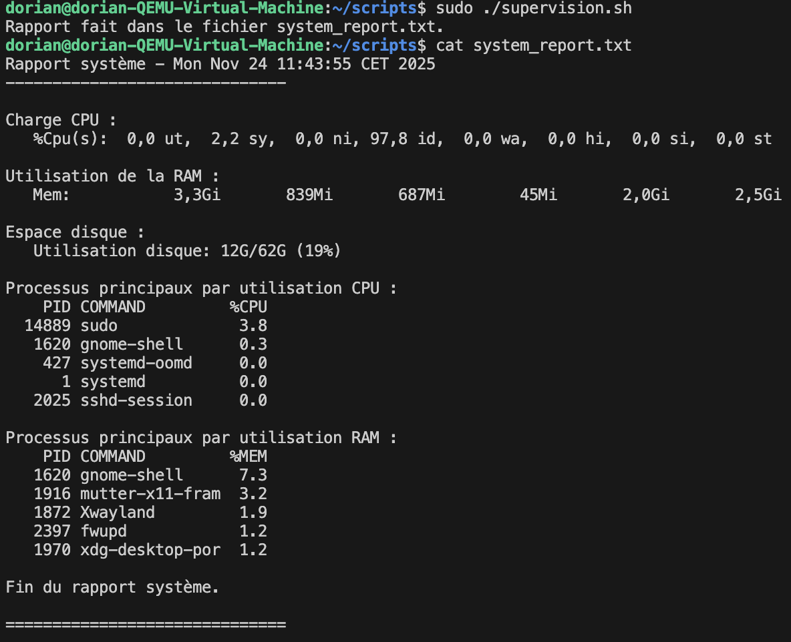
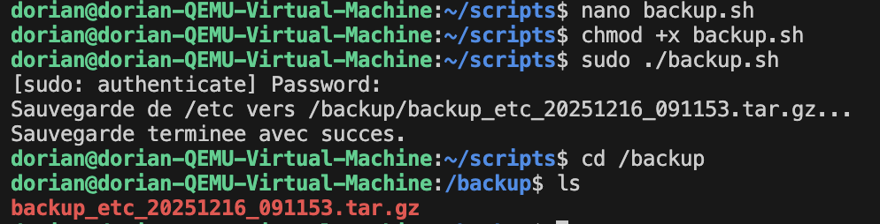
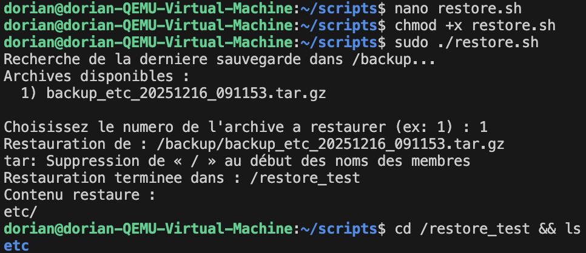

# 🧠 TP 6 – Superviser et sauvegarder ton mini-serveur Linux

## 🎯 Objectif

Mettre en place une **solution simple de supervision et de sauvegarde** sur ton système Linux.

L’objectif : prouver que ton poste est prêt à encaisser un incident sans perte de données.

## Missions

| Mission | Résultat attendu |
| --- | --- |
| 📦 **Sauvegarde** | Un script sauvegarde un dossier critique (`/etc`, `/var/www`, `/home/...`) dans une archive compressée. |
| 🔁 **Restauration** | Tu es capable de restaurer cette archive dans un dossier vierge. |
| 📊 **Supervision** | Un script affiche la charge CPU, la RAM, l’espace disque et les processus principaux. |
| 🧾 **Journal d’activité** | Tes scripts écrivent des logs avec la date et l’heure de chaque action. |
| ⚙️ **Automatisation** | Une tâche planifiée exécute la sauvegarde chaque jour. |

## Étapes de réalisation

1. Identifier les données importantes à sauvegarder.
2. Créer un script pour les archiver et les compresser.
3. Écrire un second script (ou fonction) pour restaurer.
4. Surveiller ton système avec des commandes adaptées.
5. Automatiser une partie de ton travail avec une tâche planifiée.

## Réalisation des missions

### Mission: 📊 Supervision
*Un script affiche la charge CPU, la RAM, l’espace disque et les processus principaux.*

voir le script : [system_report.sh](./scripts/system_report.sh)

Résultat du script :

### 📦 Sauvegarde
*Un script sauvegarde un dossier critique (`/etc`, `/var/www`, `/home/...`) dans une archive compressée.*

voir le script : [backup.sh](./scripts/backup.sh)

résultat du script :

### 🔁 Restauration
*Tu es capable de restaurer cette archive dans un dossier vierge.*

voir le script : [restore.sh](./scripts/restore.sh)

résultat du script :

## Le bref rapport

J'ai choisi de sauvegarder le dossier `/etc` car il contient les configurations essentielles du système. Pour vérifier l'état du serveur, j'utilise un script qui affiche la charge CPU, la RAM, l'espace disque et les processus principaux. 

Cela est utile pour détecter un problème de performance ou un dysfonctionnement avant qu'il n'affecte les services.

Dans une vraie infrastructure, je ferais appel à un expert, sinon je me renseignerais davantage sur les bonnes pratiques de sauvegarde, comme la rotation des sauvegardes, le chiffrement des données sensibles, et l'utilisation de solutions de sauvegarde automatisées et centralisées.