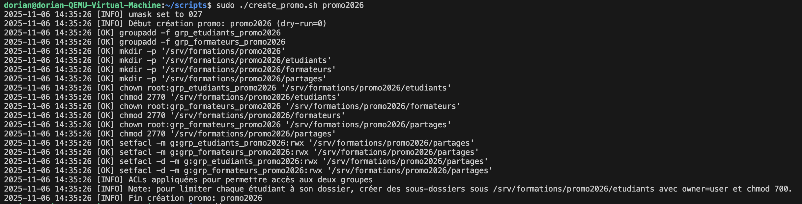

# 💻 TP Avancé – Scripting & Gestion des droits sous Linux

## 🎯 Objectifs pédagogiques

- Automatiser une tâche complète avec un script Bash.
- Manipuler finement les permissions, groupes et héritages (`setgid`, `umask`).
- Gérer la journalisation et la robustesse d’un script.
- Appliquer des bonnes pratiques d’administration système.

## 🧩 Mission

Créer un script `create_promo.sh` qui :

1. **Vérifie les arguments**
    - Le nom de la promo (`promo2026`) doit être passé en paramètre.
    - Si rien n’est passé → afficher un message d’erreur clair et l’usage.
2. **Crée l’arborescence**
    
    ```
    /srv/formations/promo2026/
        ├── etudiants/
        ├── formateurs/
        └── partages/
    
    ```
    
3. **Crée les groupes**
    - `grp_etudiants_2026`
    - `grp_formateurs_2026`
4. **Assigne les droits**
    - Dossier `etudiants` : accès restreint, chaque étudiant n’accède qu’à son dossier.
    - Dossier `formateurs` : lecture/écriture complète.
    - Dossier `partages` : accessible aux deux groupes, mais **pas aux autres** (`chmod 770`).
    - Utiliser `setgid` pour que les nouveaux fichiers héritent du bon groupe.
5. **Sécurise les créations**
    - Configurer `umask` pour éviter les fichiers en lecture publique.
    - Vérifier les retours de commandes (`$?`) et afficher des messages clairs.
6. **Journalisation**
    - Toutes les opérations doivent être loguées dans `/var/log/creation_promo.log`
        
        (avec date, commande, résultat).
        
    - En cas d’erreur, le script quitte avec un message explicite.
7. **Option bonus**
    - `-dry-run` : simule toutes les actions sans rien créer, mais affiche ce qu’il ferait.

voir le script ici : [create_promo.sh](create_promo.sh)

resultat du script : 

```bash
sudo ./create_promo.sh promo2026
```
